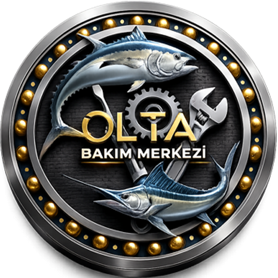
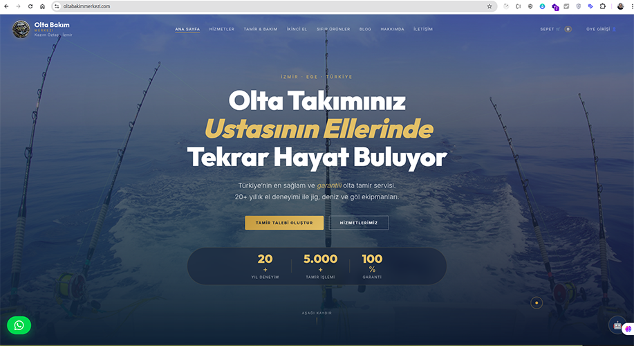
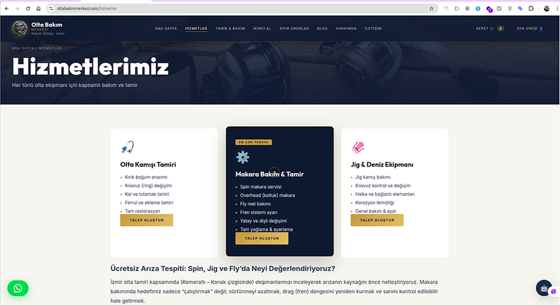

# Olta Bakım Merkezi - Tam Kapsamlı Servis ve Yönetim Platformu 🎣





**Olta Bakım Merkezi**, balıkçılık ekipmanlarının (olta makineleri, kamışlar vb.) bakım, onarım ve satış süreçlerini uçtan uca yönetmek için tasarlanmış profesyonel bir ERP ve CRM platformudur. Modern teknolojilerle geliştirilen bu sistem, hem işletme sahiplerine güçlü bir yönetim paneli sunar hem de kullanıcılara şık bir web arayüzü sağlar.

---

## 📂 Proje Yapısı ve Akış



## 🚀 Öne Çıkan Özellikler

### 🛠️ Teknik Servis ve Tamir Yönetimi

- **Servis Kabul:** Müşteriden gelen cihazların detaylı kaydı ve durum takibi.
- **Tamir Süreçleri:** Onarım aşamalarının (parça değişimi, işçilik vb.) anlık izlenmesi.
- **Cihaz Geçmişi:** Her cihazın geçmişteki tüm servis işlemlerine kolay erişim.

### 📦 Stok ve Ürün Yönetimi

- **Stok Takibi:** Yedek parça ve ürün stoklarının kritik seviye uyarılarıyla yönetimi.
- **Kategorizasyon:** Ürünlerin marka ve tip bazlı düzenli listelenmesi.
- **Varyant Yönetimi:** Farklı özelliklerdeki balıkçılık ekipmanlarının sisteme dahil edilmesi.

### 👥 Müşteri İlişkileri (CRM)

- **Müşteri Kayıtları:** Detaylı iletişim ve cihaz sahipliği bilgileri.
- **İletişim Paneli:** Site üzerinden gelen mesajların ve yorumların yönetimi.
- **Müşteri Deneyimi:** Tamamlanan işlemler sonrası müşteri yorumlarının sergilenmesi.

### 💰 Finans ve Muhasebe

- **Tahsilat Yönetimi:** Servis ve satış işlemlerine ait ödemelerin takibi.
- **Finansal Hareketler:** İşletme gider ve gelirlerinin detaylı raporlanması.

### 🌐 İçerik Yönetimi (CMS) & Web Sitesi

- **Dinamik Blog:** Sektörel yazıların ve duyuruların paylaşılabileceği gelişmiş blog yapısı.
- **SEO Uyumluluğu:** Modern sitemap ve robots.js yapılandırmalarıyla arama motoru dostu.
- **Site Ayarları:** Logo, sosyal medya ve iletişim bilgilerinin panel üzerinden güncellenmesi.

### 🤖 Yapay Zeka Destekli Dijital Asistan (Olta Asistanı)

- **Yerel LLM Entegrasyonu:** Mistral 7B Instruct (GGUF) modeli ile çalışan yerel yapay zeka.
- **Gizlilik Odaklı:** Verileriniz asla dış servislerle (OpenAI, Gemini vb.) paylaşılmaz; tüm süreç kendi sunucunuzda işlenir.
- **7/24 Akıllı Destek:** Tamir süreleri, garanti koşulları ve teknik bilgiler hakkında müşterilere anlık yanıtlar.
- **Hızlı Yönlendirme:** Karmaşık taleplerde otomatik olarak WhatsApp hattına yönlendirme.

---

## 🛠️ Teknoloji Yığını

### Backend (Golang)

- **Framework:** [Fiber (v2)](https://gofiber.io/) - Yüksek performanslı ve hafif web framework.
- **ORM:** [GORM](https://gorm.io/) - Veritabanı işlemleri için güvenli ve hızlı katman.
- **Auth:** JWT tabanlı güvenli yetkilendirme sistemi.
- **Dosya Yönetimi:** Akıllı indeksleme (klasör bazlı) ile resim ve video servisi.

### Frontend (Next.js & React)

- **Framework:** [Next.js 16](https://nextjs.org/) (App Router) - Hızlı ve SEO uyumlu arayüz.
- **State Management:** [Redux Toolkit (RTK Slice)](https://redux-toolkit.js.org/) - Merkezi veri yönetimi.
- **Styling:** Bootstrap 5 & Özel CSS (index.css) - Responsive ve kullanıcı dostu tasarım.
- **Editor:** [Tiptap](https://tiptap.dev/) - Modern zengin metin düzenleyici.

---

## 📦 Kurulum ve Çalıştırma

### 1. Gereksinimler

- Go 1.21+
- Node.js 18+
- PostgreSQL veya MySQL veritabanı

### 2. Backend Kurulumu

```bash
cd backend
go mod download
# .env dosyasını oluşturun ve veritabanı bilgilerini girin
go run main.go
```

### 3. Frontend Kurulumu

```bash
cd client
npm install
# .env.local dosyasını backend API URL'sine göre yapılandırın
npm run dev
```

---

## 📂 Proje Yapısı

### Backend

- `/handlers`: API uç noktalarının iş mantığı.
- `/models`: GORM tabanlı veritabanı modelleri.
- `/routes`: Endpoint tanımlamaları.
- `/uploads`: İndekslenmiş medya dosyaları.

### Frontend (Next.js)

- `/app`: Rota ve sayfa yapıları (Admin ve Site ayrımları).
- `/src/redux`: `apiSlice.js`, `store.js` ve özel slice'lar.
- `/components`: Tekrar kullanılabilir UI bileşenleri.
- `/public/assets`: Statik görseller ve logolar.

---

## 🔒 Güvenlik ve Optimizasyon

- Proje, canlı ortama alınırken `javascript-obfuscator` ile kaynak kod güvenliğini sağlar.
- Fiber Middleware (Compress, Recover, CORS) ile optimize edilmiş API katmanı.
- SEO çalışmaları için dinamik sitemap ve optimizasyon araçları entegre edilmiştir.

---

## 📄 Lisans

Bu proje Serhat Zafer Ülgür (tukansoft) tarafından geliştirilmiştir. Tüm hakları saklıdır.

---

⭐ _Bu repo, balıkçılık tutkunları için dijital dönüşümün bir parçasıdır._
